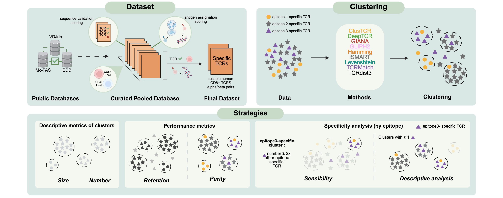

# Benchmarking unsupervised methods for inferring TCR specificity
This repository contains scripts and data to accompagny the study "Benchmarking unsupervised methods for inferring TCR specificity".

## Introduction
Identifying T cell receptor (TCR) specificity is crucial for advancing the understanding of adaptive immunity. Despite the development of computational methods to infer TCR specificity, their clustering behavior has not been thoroughly compared. We addressed this by curating a unified database of 190,670 human TCRs with known specificities for 2,313 epitopes across 121 organisms, combining data IEDB ([iedb](https://www.iedb.org/)), McPAS-TCR ([McPAS](https://friedmanlab.weizmann.ac.il/McPAS-TCR/)), and VDJdb ([VDJdb](https://vdjdb.cdr3.net/)). We asked whether widely used TCR clustering methods produce comparable results on the same high-confidence dataset. We hypothesized that shared assumptions about conserved CDR3 motifs would yield similar patterns, with differences reflecting algorithmic design. Nine methods for clustering TCRs based on similarity were benchmarked against this dataset. DeepTCR demonstrated the best retention, while ClusTCR, TCRMatch, and GLIPH2 excelled in cluster purity but had lower retention. GLIPH2, Levenshtein distance, Hamming distance and clusTCR generated large clusters in contrast to TCRMatch and DeepTCR. Smaller, antigen-specific clusters were produced by GIANA, and iSMART. DeepTCR was the most sensitive in capturing antigen-specific TCRs. We confirmed these observations using a larger dataset from 10XGenomics containing antigen-specific labelled TCRs as well non-labelled cells. This study offers a unified TCR database and a benchmark of specificity inference methods, guiding researchers in selecting appropriate tools.


## Worflow



## Analysis
This repository as the paper is composed of three parts: the process of the curated pooled database, the benchmark analysis of clustering methods and the validation on public data from 10X Genomics. This repository is organized as follow: 


```bash
.
|   .RData
|   .Rhistory
|   README.md
|   Graphical_abstract.jpeg
|
+---Analysis
|       .Rhistory
|       benchmark_tools_pooled_database_CD8.Rmd
|       database_processing.R
|       output_processing.R
|       10X_processing.R
|       10X_output_processing.R
|       10X_HD_LD_script.R
|
+---Data
|   +---Database
|   |       database_pooled_human_2023_03_15.txt
|   |       IEDB_tcell_assay_table_MHCI.csv
|   |       IEDB_tcell_assay_table_MHCII.csv
|   |       IEDB_tcell_receptor_table_MHCI.csv
|   |       IEDB_tcell_receptor_table_MHCII.csv
|   |       McPAS-TCR.csv
|   |       vdjdb.txt
|   |
|   +---Output_methods
|   |       clusTCR_output.csv
|   |       clusTCR_output_edgelist.txt
|   |       clusTCR_output_summary.csv
|   |       DeepTCR_output.csv
|   |       GIANA_output.txt
|   |       GLIPH2_output_cluster.csv
|   |       iSMART_output.txt
|   |       TCRdist3_hclust_output.csv
|   |       TCRMatch_output.txt
|   |
|   +---10X
|   |   \---Donor1
|   |       |   vdj_v1_hs_aggregated_donor1_filtered_feature_bc_matrix.h5
|   |       |   Contig_vdj_TRB_filtered.csv
|   |       |   labelled_cdr3b.csv
|   |       |
|   |       +---subsets
|   |       |       subset_1.txt
|   |       |       subset_2.txt
|   |       |       subset_3.txt
|   |       |       subset_4.txt
|   |       |       subset_5.txt
|   |       |       subset_6.txt
|   |       |
|   |       \---input
|   |           |   Parameter_file_beta_Gliph2.cfg
|   |           |   CommandLine_DeepTCR.txt
|   |           |   CommandLine_TCRdist3.txt
|   |           |   CommandLine_ClusTCR.txt
|   |           |   CommandLine_GIANA_iSMART.txt
|   |           |   CommandLine_TCRMatch.txt
|   |           |
|   |           +---Gliph2
|   |           |       ...
|   |           |
|   |           +---DeepTCR
|   |           |   +---...
|   |           |
|   |           \---TCRdist3
|   |                   ...
|   |
|   \---10X_Output_methods
|       +---output_clusTCR
|       |   +---...
|       |
|       +---output_GIANA
|       |       ...
|       |
|       +---output_TCRMatch
|       |       ...
|       |
|       +---output_iSMART
|       |       ...
|       |
|       +---output_gliph2
|       |   +---...
|       |
|       +---output_HD
|       |       ...
|       |
|       +---output_LD
|       |       ...
|       |
|       +---output_DeepTCR
|       |       ...
|       |
|       \---output_TCRdist3
|           +---...
+---Functions
|       .Rhistory
|       alignment_functions.R
|       general_functions.R
|       network_functions.R
|       purity_functions.R
|       similarity_functions.R
|       subset_functions.R
|
+---Plot
|       6EpitopeSelection.pdf
|       AllMetricsTh_1.pdf
|       AllMetricsTh_1_byChain.pdf
|       AllSpecificitiesInSpeClusters_GIL.pdf
|       clusterSizeDistribution.pdf
|       correlationPurityRetention.pdf
|       NumberSpecificities_GIL.pdf
|       PercClusteredSeq_GIL.pdf
|       PercClusters_GIL.pdf
|       purityChain.pdf
|       SensibilityAllEpitopes.pdf
|       Sensibility_GIL.pdf
|       AllMetricsTh_1_barplot.pdf
|       AllMetricsTh_3_barplot.pdf
|       AllMetricsTh_5_barplot.pdf
|       AllMetricsTh_10_barplot.pdf
|       purityChain_barplot.pdf
|       AllMetricsTh_1_byChainbis.pdf
|       sensitivity_GIL.pdf
|       sensitivityAllEpitopes.pdf
|       Retention_subset.pdf
|       Purity_subset.pdf
|       Perc_NonAnnotatedCdr3_subset_a.pdf
|       Perc_NonAnnotatedCdr3_subset_b.pdf
|       Perc_NonAnnotatedCdr3_subset_c.pdf
|       Perc_annotatedCDR3relativetosubset_1.pdf
|       Perc_AnnotatedCdr3_subset_a.pdf
|       Perc_AnnotatedCdr3_subset_b.pdf
|       Perc_AnnotatedCdr3_subset_c.pdf
|       Percentage_Annotated_cdr3.pdf
|       metric_table.csv
|       ProportionOfClusterWithNonAnnotatedCdr3_a.pdf
|       ProportionOfClusterWithNonAnnotatedCdr3_b.pdf
|       ProportionOfClusterWithNonAnnotatedCdr3_c.pdf
|
\---Pooled_Database
        .Rhistory
        database_processing_human.R
        description_database.R
        iedb_curation.R
        McPAS_curation.R
        vdj_curation.R
        Fig1_C-Fbis.pdf
```


### 1. Process the pooled database
Scripts to process the 3 public databases are available in the /Pooled_Database/ folder.
- iedb_curation.R: Curation of the IEDB database.
- McPAS_curation.R: Curation of the McPAS database.
- vdj_curation.R: Curation of the VDJdb database.
- database_processing_human.R: Imports the 3 curated databases and assemble them into a single pooled database.
All original database and final pooled human database are provided in the /Data/Database/ folder.
- description_database.R: Create descriptive plots for the pooled human database saved in the /Plot/ folder (referring to the Figure 1 of the study).

### 2. Perform the benchmarking analysis
- (main) /Analysis/benchmark_tools_pooled_database_CD8.Rmd: Rmarkdown file which prove all analyses to compare the clustering methods. Results plots are stored in the /Plot/ folder (referring to other Figures of the paper).
- /Analysis/output_processing.R: Reads and processes the output of clustering methods stored in the /Data/Output_methods/ folder. 
- /Functions/ folder : Contains the database_processing.R script that processes and filter the pooled human database for the analysis and all other functions useful for the benchmark.

### 3. 10X analysis
Scripts for the analysis of the 10X Genomics are available in:
- /Analysis/10X_processing.R: processing of the public 10X data.
- /Analysis/10X_HD_LD_script.R: performing the Hamming and Levenshtein Distances on 10X data.
- /Analysis/10X_output_processing.R: anlyzing the outputs of compared methods using metrics described in the paper.


## Data acquisition
WARNING: Data from public databases were downloaded between January and March 2023. So please keep in mind that if you use a more recent version of these databases, the final pooled human database resulting from curation may be different. The original data used in this analysis is provided in this repository, but some versions of the R package may have been modified since the database_processing_human.R script was created and may also lead to a different human grouped database. 

Steps to download public databases: 
- Data from McPAS-TCR database were directly downloaded from the home page of the web site at https://friedmanlab.weizmann.ac.il/McPAS-TCR/
- Data from VDJdb were uploaded from the original web site at https://vdjdb.cdr3.net/about
- For IEDB data, we have started from the home page https://www.iedb.org/ and selected the following criteria:
                - Epitope:"Any"
                - Assay:"T Cell" and Outcome:"Positive"
                - Epitope source:no filter
                - MHC Restriction:"Class I"
                - Host:"human"
                - Disease:"Any"
Once the page was loaded, the filter TCR_type: "has TCR sequence" was added. Then, we have downloaded the Assays and Receptors tables. Finally, we have re-performed this manip using MHC-Restriction:"Class II" resulting in 4 files.

## 10X data acquisition
The publicly available TCR dataset is generated by 10X genomics from CD8+ T-cells of four human donors with single cell resolution on gene expression, expression of 11 surface proteins and paired αß TCR sequences together with peptide-MHC binding, providing information on TCR specificity (CD8+ Tcells of healthy donors sorted for Dextramer positive cells). Antigen specificity was assessed using 44-MHC class I dextramers (Immudex), each loaded with a distinct antigenic peptide derived from different viruses (CMV, EBV, Influenza, HTLV, HPV and HIV) or from known cancer antigens. Moreover, six dextramer reagents carrying irrelevant peptides were added as negative controls. Each dextramer was labeled with a distinct nucleic acid barcode and a phycoerythrin (PE) fluorophore. The data from Donor1 can be downloaded at https://zenodo.org/records/6952657. 

## Figures
All plots of the paper are available in the /Plot/ folder of this repository.

## Support
For any questions regarding the analysis, bug reports or feature requests, please submit an issue. 
